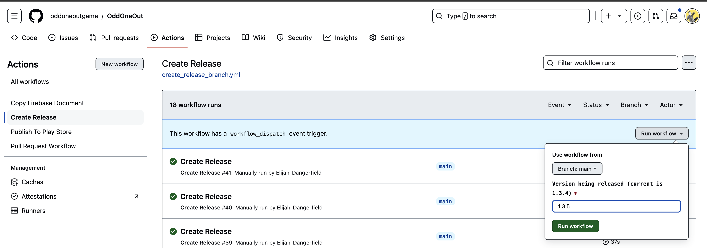
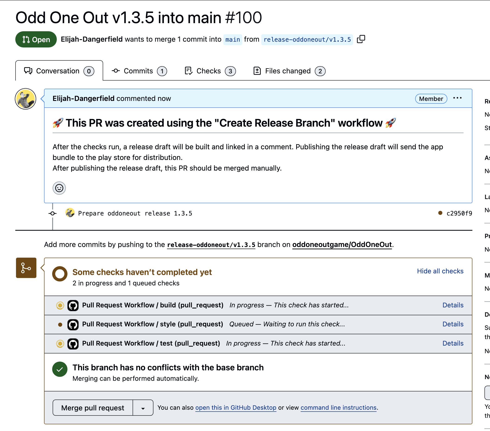
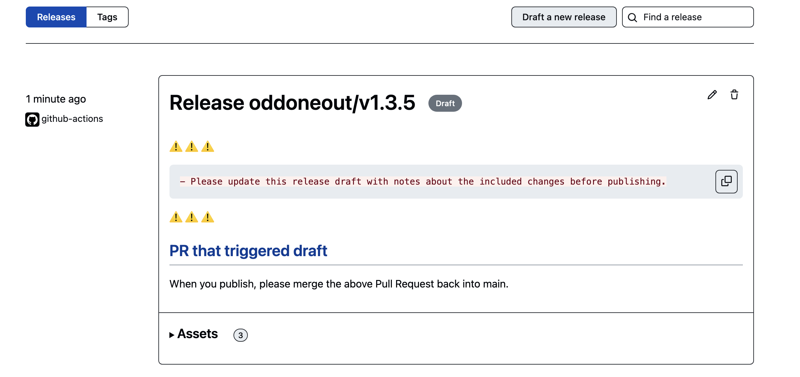
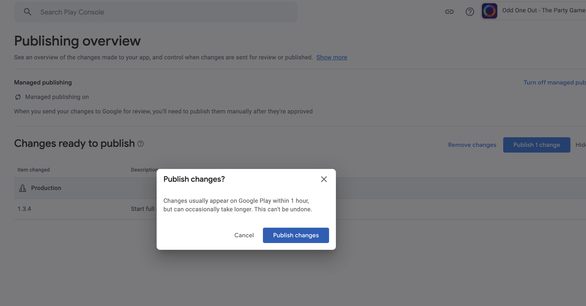

# How to Release

## The Steps

### 1. Create the release branch (aka cut it)

To do this, on github, navigate to `actions` -> `Create Release` -> `Run Workflow`. 
On the drop down menu enter in the version for the release and then click `Run Workflow`.

This will create a release branch and put up a PR into main

#

### 2. Publish the Github Release Draft

Once the checks pass on the release PR a draft release will be created on github.

You can find draft releases here:
https://github.com/oddoneoutgame/OddOneOut/releases 

On the draft release click `Edit` and fill in the release notes.
Then scroll to the bottom and click `Publish Release`.

This will automatically send the build to the google play store for publishing in the store

#

### 3. Merge the release branch

Once the release is published on github, merge the release branch into main. We couldnt automate this
for some reason. 

#

### 4. Publish the app on the google play store

You should be able to find the release on the "Releases Overview" page on the google play console.

From there you can click "Review" and then "Start Rollout to Production" to publish the app to the store.
Typically you just need to copy previous release notes but you may need to make new ones. In which case you will need to create a translation for each language.

As of now we just roll out to 100%

