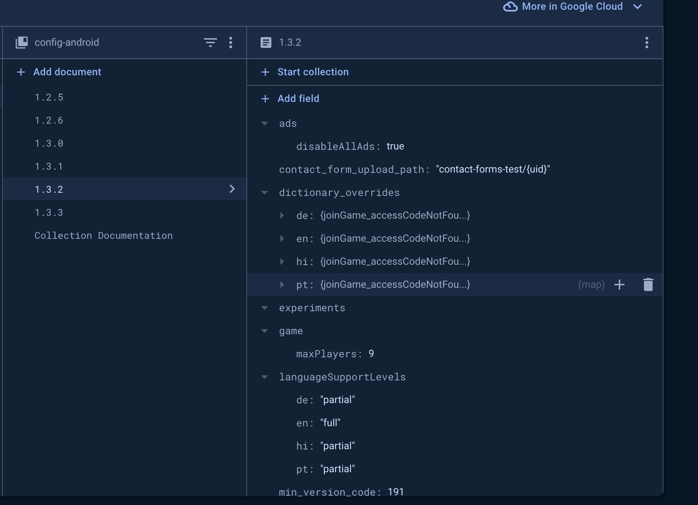

# Dictionary

The dictionary is where the app gets all of its strings from. By default the dictionary contains all of the
strings packaged with the app when its delivered. However, the dictionary values can be individually overriden
by a backend configuration. This allows us to update copy on the fly without having to update the app. Which tends to come
in handy more often then i'd like to admit. 

# Usage
The strings can be accessed by calling `Dictionary.getString(resId")` or from a composable using
`dictionaryString(id = R.string.resId)`.

# Adding a new string
To add a new string to the dictionary, simply add a new string resource to 
the `res/values/strings.xml` file in the `dictionary` module. The naming convention for new strings is
as follows: `nameSpace_usage_type`. 

### nameSpace:
Lowest common logical ancestor that owns this string.
Frequently this will be the name of the feature module but could be a sub feature or
a logical group in the app. Or for app wide strings it will be "app"

### usage:
Where and or how the string will be used. This is very loosely defined. Ideally when reading
it will give the reader information about which string this is specifically.

examples: leaveDialog, userNameFieldError.. etc.

Special Usages:
bullets - refers to a text separated by new lines that will be rendered with a each section having a bullet point
parts - refers to a text separated by new lines that will be rendered with each section being separated by some spacer

### type:
What type of component uses this string. We have a running list of logical types below.
New types can be added as needed.

label
text
header
body
hint
link
action
a11y

# Translating
If the git hooks are installed (which they have to be to build) then pushes will fail if we detect that
a string was changed in one language but not every other. This is to ensure that we keep all languages in sync.
To translate a string.... talk to chat gpt (sorry not sorry).

# Adding an override
Overrides come via the config. They are stored in a `dictionary_overrides` field as a simple mapping of resId to string.

